# three-tile 介绍

three-tile 是一个开源的轻量级三维瓦片库，它基于threejs使用typescript开发，提供一个三维地形模型，能轻松给你的应用增加三维瓦片地图。

|  |  |
| ------------------------------------------------------------ | ------------------------------------------------------------ |
|  |  |

源码：https://github.com/sxguojf/three-tile

示例：https://github.com/sxguojf/three-tile-example

## 1. three-tile是什么？

* three-tile 是 webgis？No，它的gis功能很弱，仅提供了三维地图模型和地理坐标转换功能。
* three-tile 是基于cesium、mapbox等的二次封装吗？No，它是基于 threejs 自主实现的。
* three-tile 更像是游戏开发中的LOD地形，但它可以使用地图服务商提供的地形和影像瓦片数据渲染地图。
* three-tile 的地图被封装为一个普通的 Mesh，能轻松添加进[ threejs ](https://threejs.org/)应用中。
* three-tile 的核心实际与地图无关，它就是一个LOD模型，地图只是其典型应用之一。

## 2. 开发初衷

* 市面上的三维 webgis 框架不少，如[ cesium](https://cesiumjs.org/)、[MapBox.gl ](https://openlayers.org/)等，功能强大，但这些地图作为重量级框架，它包揽了三维场景、摄像机、模型、灯光等一切，想深度定制难度较大，另外，它们本身占用资源太多，功能一多速度难以满足需求。

* 三维地形也是游戏引擎中的重要功能之一，但主流的游戏引擎地形数据要么随机生成，要么美工手工设计，地形制作工作量较大。当然，unity3d、unreal4等游戏引擎，也有一些插件可以导入真实地形，但通用性较差，操作复杂。

**是否能将真实地图数据与游戏的三维地形结合，提供一个使用瓦片地图服务的轻量级三维地形模型？好，这就是three-tile的开发初衷。**  

## 3. 3D开发技术选型

* webgl： web下3D开发必备，但直接基于webgl开发很繁琐，选择一个3D引擎能大大节省开发时间。
* threejs： 封装了webgl，使用简单，国内具有非常好的生态。
* babylonjs： 封装了webgl，大厂出品，ts编写，支持webgpu，但国内生态不如threejs。
* unity3d： 游戏引擎，可用C#、JavaScript开发，但主要用于游戏，web端支持较差。
* unreal： 游戏引擎，主要用于游戏，只能做桌面版。

综合比较，如果开发web版的3d地图，选择threejs和babylon.js更加适合，考虑个人开发影响力太小，需要借助其它框架生态，那threejs是首选。

当然，如果确实有需求，我觉得用babylon或unity3d也可以考虑。目前还是使用threejs开发。

## 4. 典型应用场景

### 4.1 给现有应用增加地形

在threejs示例中，大部分简单应用使用一个平面作为地面，如果能把平面换为真实地形，立马增色不少：

|      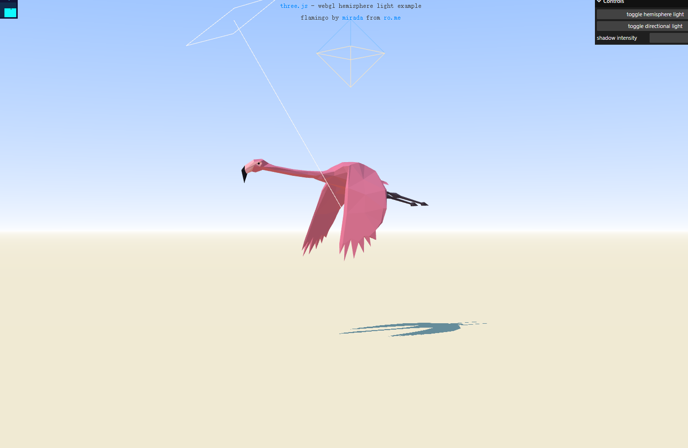threejs中的傻鸟      | 加上地形，让它翱翔在青藏高原 |
| :----------------------------------------------------------: | :----------------------------------------------------------: |
| [three.js examples (threejs.org)](https://threejs.org/examples/#webgl_lights_hemisphere) | [three-tile demo (sxguojf.github.io)](https://sxguojf.github.io/three-tile-example/step3.2/index.html) |

|       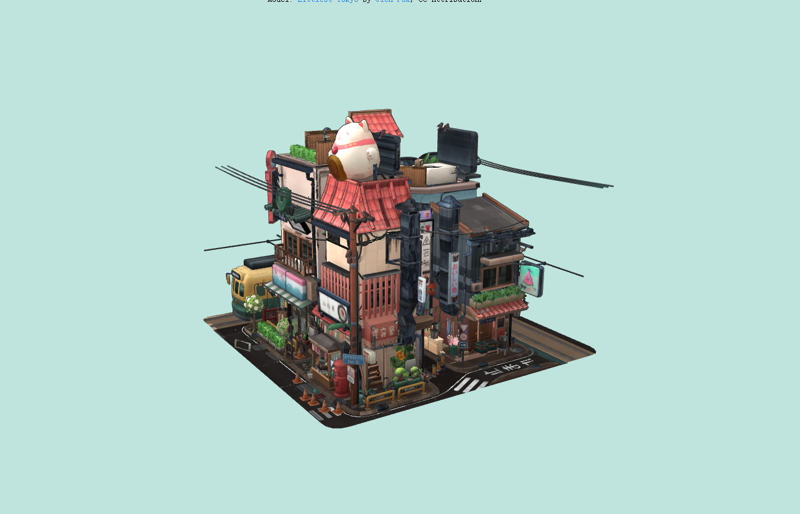threejs中可爱的小房子       | 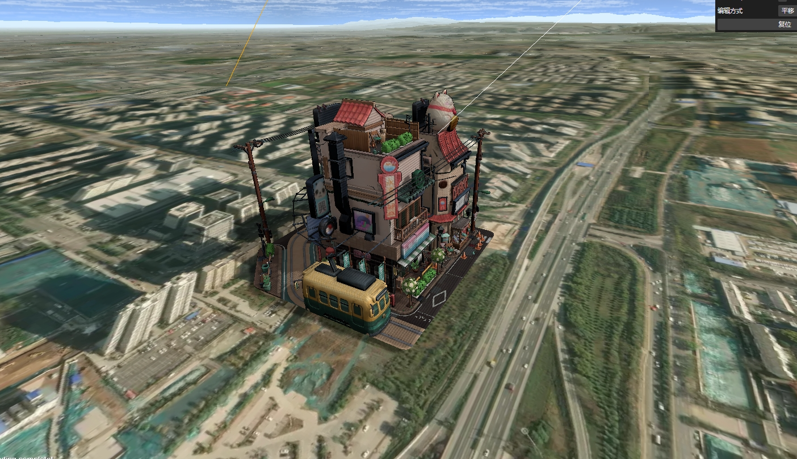西安南二环找块工地放上去  |
| :----------------------------------------------------------: | :----------------------------------------------------------: |
| [three.js examples (threejs.org)](https://threejs.org/examples/#webgl_animation_keyframes) | [three-tile demo (sxguojf.github.io)](https://sxguojf.github.io/three-tile-example/step2.10/index.html) |

|   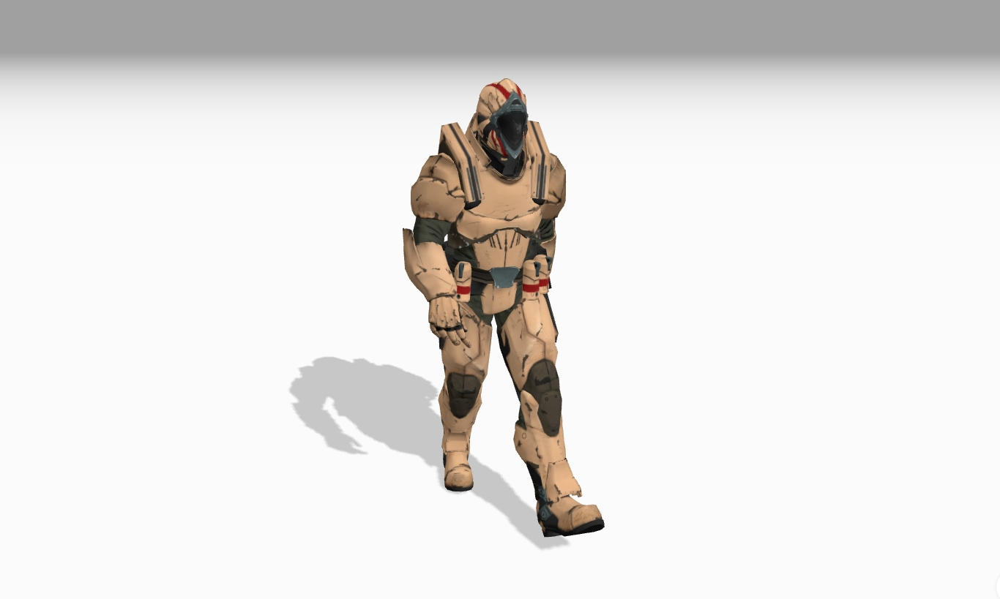threejs中孤独的小兵兵   | 放到地图上执行任务 |
| :----------------------------------------------------------: | :----------------------------------------------------------: |
| [three.js examples (threejs.org)](https://threejs.org/examples/#webgl_animation_skinning_blending) | [three-tile demo (sxguojf.github.io)](https://sxguojf.github.io/three-tile-example/step3.4/index.html) |

|  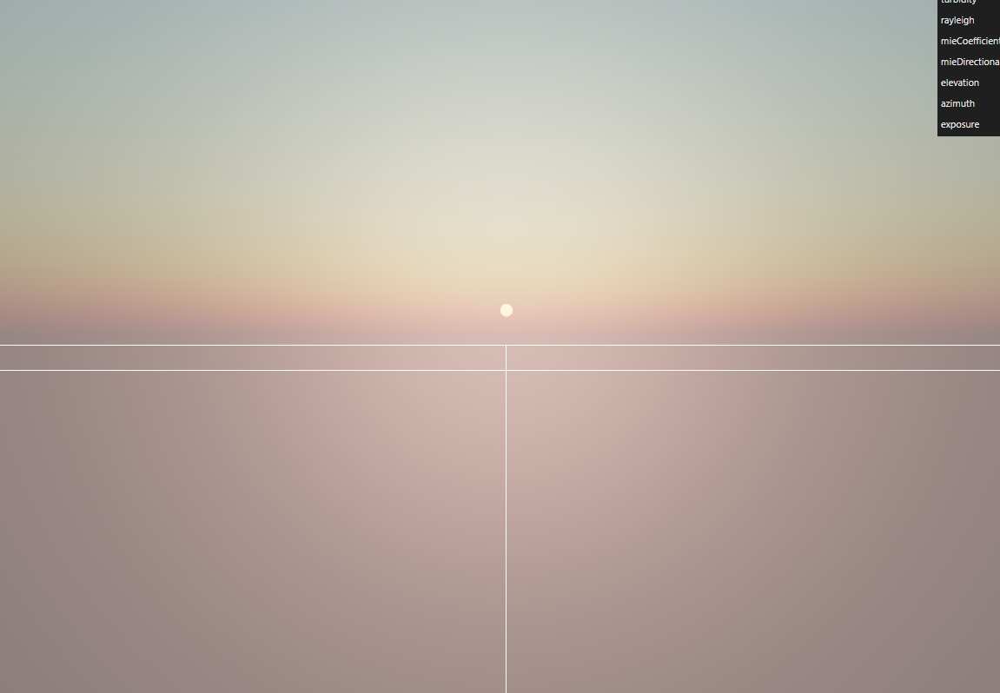threejs中平淡无奇的夕阳  | 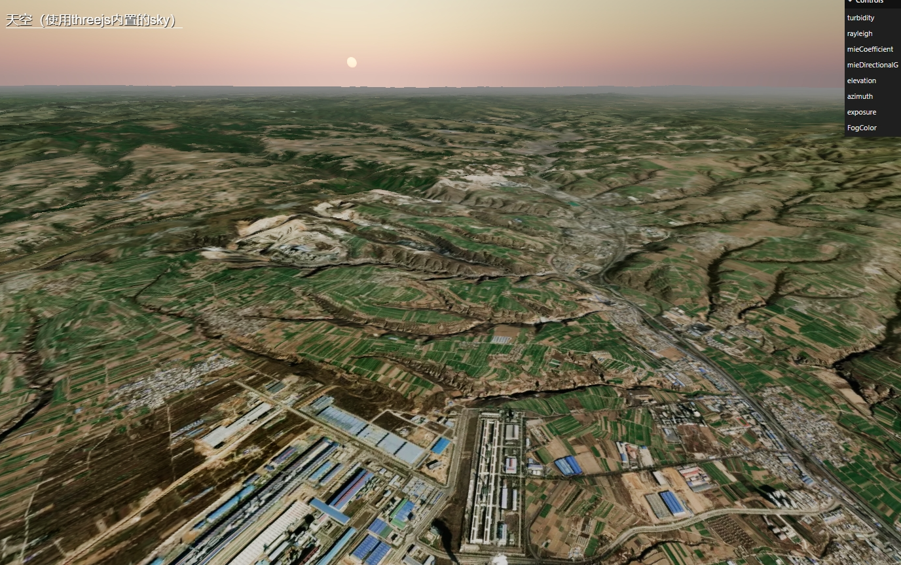加上地形才是它真正的效果  |
| :----------------------------------------------------------: | :----------------------------------------------------------: |
| [three.js examples (threejs.org)](https://threejs.org/examples/#webgl_shaders_sky) | [three-tile demo (sxguojf.github.io)](https://sxguojf.github.io/three-tile-example/step2.11/index.html) |

而这一切使用three-tile仅需三步：

1. 定义地图数据源
2. 创建地图模型
3. 用地图替换原来的平面

### 4.2 简单的webgis

当然，你如果要把three-tile当做一个简单三维gis也未尝不可，地图模型可直接使用主流瓦片数据源，渲染出逼真的地形；提供地理坐标（经纬度海拔高度）到三维场景坐标的转换，将地图元素（模型、标签）叠加在指定位置；通过鼠标键盘控制摄像机，实现地图缩放、平移、旋转和漫游；内置mapbox、bing、goole、arcgis、天地图、高德、腾讯等瓦片地图支持，也可以自行扩展支持其它瓦片地图服务。

|  | 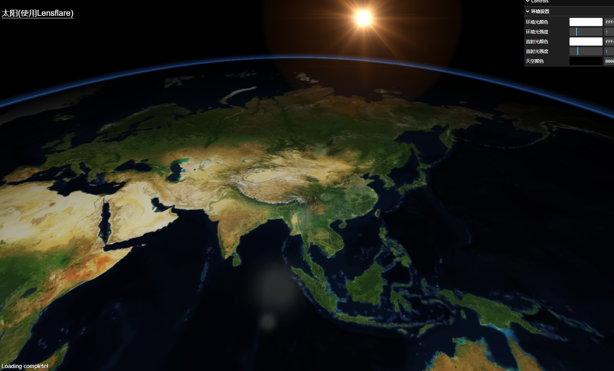 |  |  |
| ------------------------------------------------------------------ | ------------------------------------------------------------------ | ------------------------------------------------------------------ | ------------------------------------------------------------------ |
| 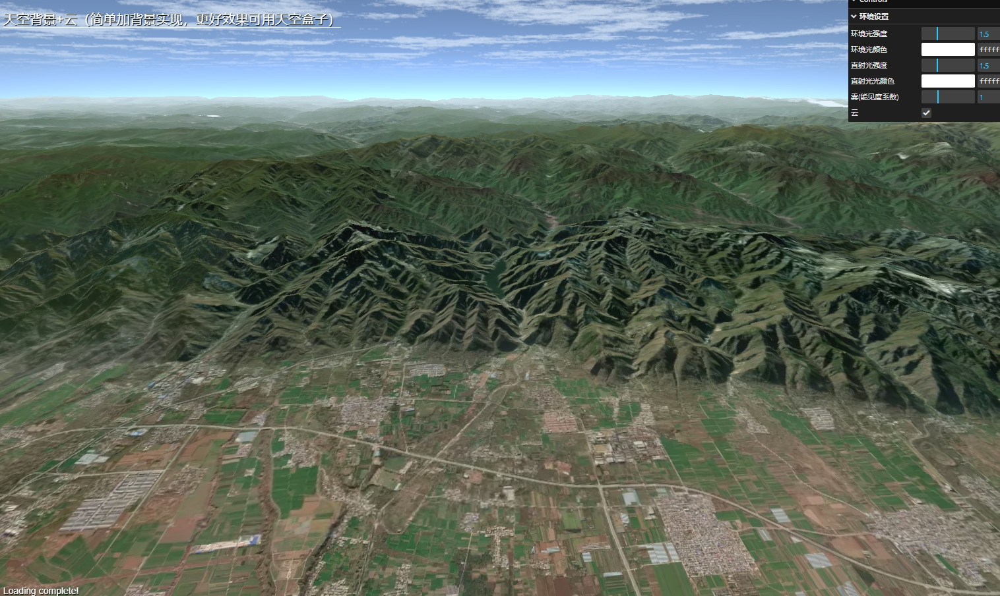 | 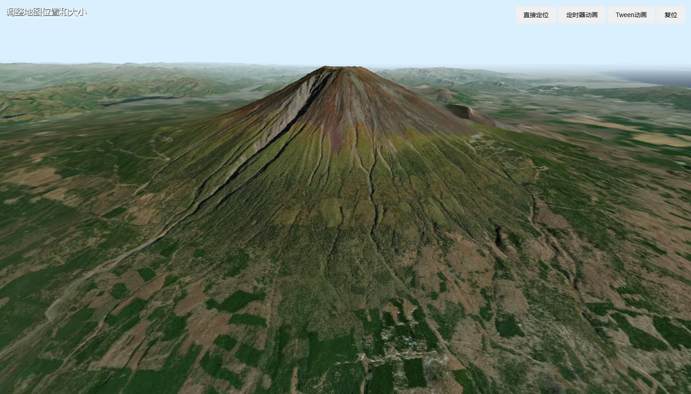 |  | 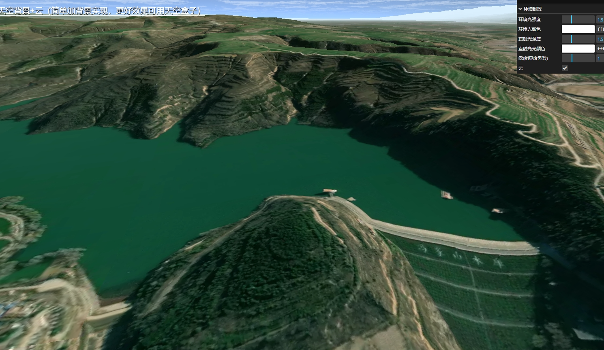 |

### 4.3 游戏开发

如果你想将three-tile用于游戏开发，也可以试试，它完美支持threejs内置的各种控制器，仅更换控制器，即可实现第一人称、飞行等游戏功能，在真实地图上开战效果应该不错。由于地图是实时下载的，如果对地图加载中的空白块不爽，可以通过调整地图的数据缓存和渲染缓冲区大小参数，以空间换时间缓解这个问题。

| 第一人称射击 | 即时战略 | 模拟飞行 |
| :----------------------------------------------------------: | :----------------------------------------------------------: | :----------------------------------------------------------: |
| [three-tile demo](https://sxguojf.github.io/three-tile-example/step3.3/index.html) | [three-tile demo](https://sxguojf.github.io/three-tile-example/step3.4/index.html) | [three-tile demo](https://sxguojf.github.io/three-tile-example/step3.2/index.html) |

### 4.4 数据可视化

目前，three-tile在生产环境的应用主要是数据可视化：

| 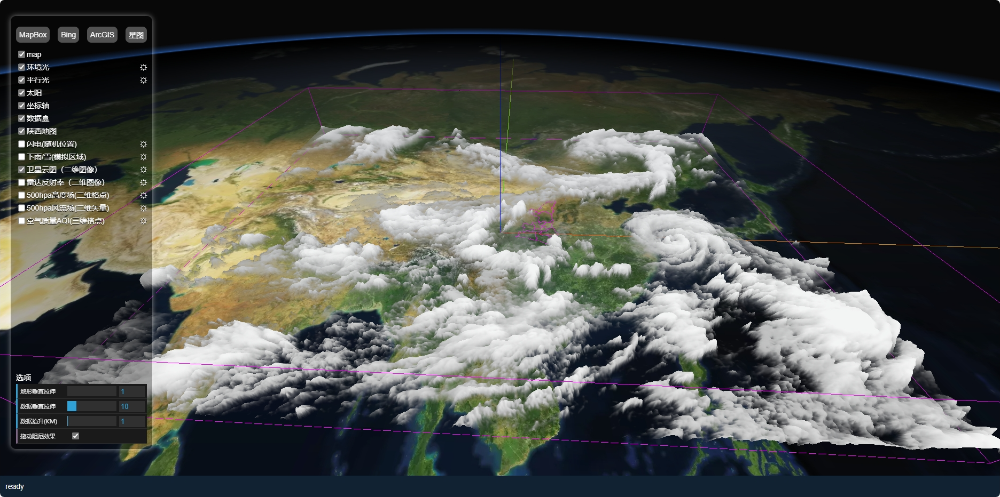三维卫星云图 | 风场动画 |
| :----------------------------------------------------------: | :----------------------------------------------------------: |
| [three-tile demo](https://sxguojf.github.io/three-tile-example/step5.2/index.html) |                                                              |
| 500hpa高度场 | 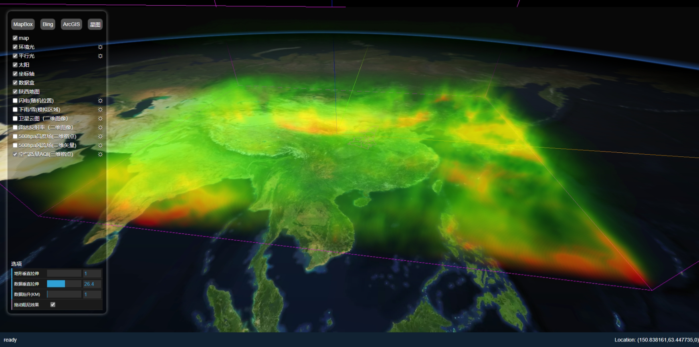pm2.5体渲染 |
| [three-tile demo](https://sxguojf.github.io/three-tile-example/step5.4/index.html) |                                                              |

总之，three-tile仅提供一个地形Mesh，利用threejs的强大生态实现各种炫酷的效果。如果你是threejs开发者，值得一试。

## 5. 特点

* 轻量级：地图以一个三维模型方式提供，使用它不会对已有程序架构产生任何影响。	

- 依赖少：整个框架仅有 threejs（R165）一个依赖。

- 速度快：对资源占用做极致优化，核显也能轻松跑到 60FPS。

- 使用简单：熟悉 threejs 基本上没有学习成本。

- 扩展性强：数据、模型、纹理、材质、渲染过程均能根据自己需要扩展和替换。

## 6. 局限性

能力有限，three-tile目前还有一些短板，期待有兴趣的开发者参与。

* 地图未使用球面坐标系：为了保持库的简洁，地图模型使用笛卡尔坐标，地球并不是个球，而是投影到了平面。

  为什么不做成球，一方面是为了开发简单，另一方面使用球面坐标系，threejs内置的大部分几何体、着色器都需要修改，如BoxGeometry，它的边不能是直线，而要与地球曲率相适应，threejs的生态完全不适用了。开始的开发计划，就是打算做个平面地图，毕竟从太空才能看出来地球是个球，但无法满足贪婪的用户需求，好吧，搞个伪球体把多余的部分遮住，远看像个球就行了。

* 存在z-fight问题： 受计算精度影响，在远距离观察时，webgl分不清物体的前后遮挡，即存在让所有三维开发者头痛的z-fight问题。

  既想在数万公里看地球，又要贴地看清地面的小汽车，z-fight不可避免，虽然可以使用logarithmicDepthBuffer缓解，但这个缩放范围实在太大了，上万公里高空webgl已经无法分清你的模型距地0.1公里还是0.2公里，它会不停闪烁。能否参考cesium使用分段渲染的方式解决？但three-tile初衷是只是做一个模型，不涉及模型外的东西，如果z-fight确实对你的应用影响较大，那可以试试分段渲染。

* 贴地功能未实现：three-tile最大的短板是贴地功能，目前贴地是使用射线法计算地形高度，但效率太低，线、面的贴地计算量太大无法完成。

  cesium使用深度缓冲区对模型进行剪裁实现，真是脑洞大开！我也尝试使用深度缓冲区使用着色器进行三维模型重建，但无奈未能成功。

* 暂未做移动端匹配：要改的太多，暂没有精力。

  