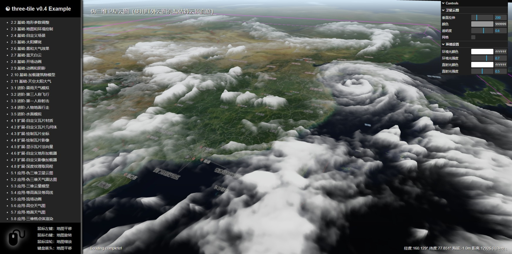

# **three-tile V0.5**

<p align='right'>hz_gjf@163.com  SXMB</p>

## 1 简介

three-tile 是一个使用 [threejs](https://threejs.org/)开发的轻量级三维瓦片地图库，具有使用简单、资源占用少等优点，适用于给基于 threejs 开发应用增加三维地图。

-   three-tile 本质上是一个动态 LOD 模型，核心代码与地图是无关的，适用范围并不仅限于地图，但最典型的应用还是三维地图。

-   three-tile 不是一个 GIS 框架，它并不提供图层管理、空间分析等 GIS 相关功能。正因为如此，它的核心可以做的很轻量级，能轻松集成到已有项目中。




免责声明：

-   本框架不含任何地图数据，Example 中使用的地图均为直接调用第三方数据，使用中请遵循法律法规要求。

### 1.1 特点

-   轻量级：地图以一个三维模型方式提供，不会对已有程序架构产生任何影响。
-   依赖少：整个框架仅有 threejs（R152）一个依赖。
-   速度快：对资源占用做极致优化，核显也能轻松跑到 60FPS。
-   使用简单：熟悉 threejs 基本上没有学习成本。
-   扩展性强：数据、模型、纹理、材质、渲染过程均能根据自己需要扩展和替换。

### 1.2 开发环境

-   语言：TypeScript 100%
-   IDE： VSCode
-   打包：Vite 4.0
-   依赖：three 0.152

---

## 2 安装

### 2.1 直接引用

```
<script src="./three.js"></script>
<script src="./three-tile.umd.js"></script>
```

### 2.2 npm

```sh
npm i three-tile -S
```

```sh
yarn add three-tile -S
```

https://www.npmjs.com/package/three-tile

---

## 3 使用

和一般 threejs 应用一样，初始化 threejs 三维场景后，将地图模型加入场景即可完成地图的显示。

使用按以下步骤：
1. 初始化三维场景
2. 定义地图数据源
3. 创建地图模型
4. 地图模型加入三维场景

### 3.1 初始化三维场景
three-tile的三维场景初始化和threejs相同，按threejs的套路初始化场景、摄像机、控制器、灯光等即可。为了便于使用，three-tile 还提供一个 GLViewer 类，它封装了场景初始化过程，可直接使用它进行初始化。但如果你熟悉 threejs，最好自己写，跟普通 threejs 程序并无太大差异。
``` typescript
import * as tt from "three-tile";

// 取得地图dom
const glContainer = document.querySelector<HTMLElement>("#map");
// 初始化三维场景(调用three-tile内置的初始化类)
const viewer = new tt.plugin.GLViewer(glContainer!);
```

自行创建场景需要以下部分需要注意：

-   为了使地图坐标系与一般人类理解一致，three-tile地图坐标方向采用东(x)北(y)上(z)方向，即地面在 x-y 平面上，海拔高度在 z 轴。而 threejs 一般平面在 xz 平面上，高度为 y 轴，所以初始化时需要使场景默认 up 指向 z 轴，可添加：Object3D.DEFAULT_UP.set(0, 0, 1) 即可。如果你的应用不能调整 up 值，可以将地图旋转-π/2° 完成。
-   地图添加光照才能显示。一般至少要有一个环境光，另外最好加一个直射光以通过地形法向量增强凹凸感。
-   场景控制器一般应用可使用 threejs 内置的 MapControls，其它控制器如 OrbitControls、FlyControls、PointerLockControls、TransformControls、FirstPersonControls 都能完美支持。

### 3.2 定义地图数据源

three-tile内置了Mapbox、ArcGis、Bing、天地图、高德、腾讯等多个厂商的瓦片地图源，可直接调用，也可根据根据需要自行扩展。地图切片默认使用Google方案，地形瓦片支持MapBox的terrain-rgb和ArcGis的LERC格式。如MapBox数据源创建如下：
```typescript
import * as tt from "three-tile";

// MapBoxToken 请更换为你自己申请的key
const MAPBOXKEY = "xxxxxxxxxx";

// mapbox 影像数据源
const mapBoxImgSource = new tt.plugin.MapBoxSource({
	token: MAPBOXKEY,
	dataType: "image",
	style: "mapbox.satellite",
});

// mapbox 地形数据源
export const mapBoxDemSource = new tt.plugin.MapBoxSource({
	token: MAPBOXKEY,
	dataType: "terrain-rgb",
	style: "mapbox.terrain-rgb",
	maxLevel: 15,
});
```
**注意：**

1. 多数数据源需要申请token才能使用，请不要用我示例中的。
2. 部分国外的地图无法访问，或是速度很慢，这个需要自己想办法，你们懂的。
3. 国内地图使用“火星坐标系”，影像图与地形有可能无法套准。
3. 地图数据使用，请遵循法律法规要求。

### 3.2 地图创建

使用 TileMap类的工厂方法 create() 创建地图，加入场景。

```typescript
import * as tt from "three-tile";

// 创建地图
const map = tt.TileMap.create({
	// 影像数据源
	imgSource: mapBoxImgSource,
	// 地形数据源
	demSource: mapBoxDemSource,
	// 地图投影中心经度
	centralMeridian: 90,
	// 最小缩放级别
	minLevel: 2,
	// 最大缩放级别
	maxLevel: 18,
});

// 将地图加入三维场景
viewer.scene.add(map);
```


## 4. 约定和限制

-   坐标轴：地图模型为东北上坐标系，即 X 轴指向东，Y 轴指向北，Z 轴指向上。与 threejs 默认坐标不同需要注意。
-   坐标单位：角度单位为弧度，经纬度为度，3857 投影（默认）距离单位为公里，4326 投影距离单位为 0.01 度，高度单位均为公里。
-   瓦片数据：内建的地图影像和地形数据均使用图片格式（jpg、png、webp 等），支持 3854 和 4326 投影，暂不支持矢量瓦片。
-   瓦片属性：默认情况瓦片模型纹理透明属性开启，请注意渲染顺序。
-   地图清晰度：清晰度与本框架无关，取决数据源精度。
-   地图标注源：大部分国内厂商地图数据的地名、边界、道路有一定偏移，与地形无法完全匹配。
-   地图 token：大部分厂商的地图数据需要申请开发 key 才能使用，three-tile 示例包含一些厂商的 token，访问的人多了厂商会封掉它们，使用者一定要自己申请（又不要钱）避免直接使用。


更多使用方法见 example

## 5. 示例

提供一个完整浏览器引入方式示例供测试，可不用web服务直接在文件系统下运行：

```html
<!DOCTYPE html>
<html lang="zh-cn">
	<head>
		<meta charset="utf-8" />
		<meta
			name="viewport"
			content="width=device-width, user-scalable=no, minimum-scale=1.0, maximum-scale=1.0"
		/>
		<title>three-tile</title>
	</head>
	<style>
		html,
		body {
			background-color: #333;
			height: 100%;
			width: 100%;
			padding: 0;
			margin: 0;
			display: flex;
		}
		#map {
			flex: 1;
		}
	</style>
	<body>
		<div id="map"></div>
		<script src="./three.js"></script>
		<script src="./three-tile/three-tile.umd.cjs"></script>
		<script>
			console.log("three-tile start!");

			// MapBoxToken 请更换为你自己申请的key
			const MAPBOXKEY ="xxxxxxxxxx";

			// mapbox影像数据源
			const mapBoxImgSource = new tt.plugin.MapBoxSource({
				token: MAPBOXKEY,
				dataType: "image",
				style: "mapbox.satellite",
			});
			// mapbox地形数据源
			const mapBoxDemSource = new tt.plugin.MapBoxSource({
				token: MAPBOXKEY,
				dataType: "terrain-rgb",
				style: "mapbox.terrain-rgb",
				maxLevel: 15,
			});

			// 创建地图
			const map = tt.TileMap.create({
				// 影像数据源
				imgSource: mapBoxImgSource,
				// 地形数据源
				demSource: mapBoxDemSource,
				// 地图投影中心经度
				centralMeridian: 90,
				// 最小缩放级别
				minLevel: 2,
				// 最大缩放级别
				maxLevel: 18,
			});

			// 地图中心经纬度转为场景坐标
			const center = map.geo2pos(new THREE.Vector3(108.942, 34.2855));
			const container = document.querySelector("#map");
			const viewer = new tt.plugin.GLViewer(
				container,
				new THREE.Vector3(center.x, center.y, 0),
				new THREE.Vector3(center.x, center.y, 3e4),
			);

			viewer.scene.add(map);

			// 添加地图坐标轴
			const helper = new THREE.AxesHelper(1000);
			helper.position.set(center.x, center.y, 1);
			viewer.scene.add(helper);

			// 动画漫游到3500km高空
			(() => {
				const timer = setInterval(() => {
					const pos = viewer.camera.position;
					pos.z -= 500;
					pos.y -= 10;
					if (pos.z < 100) {
						clearInterval(timer);
					}
				}, 10);
			})();
		</script>
	</body>
</html>
```


