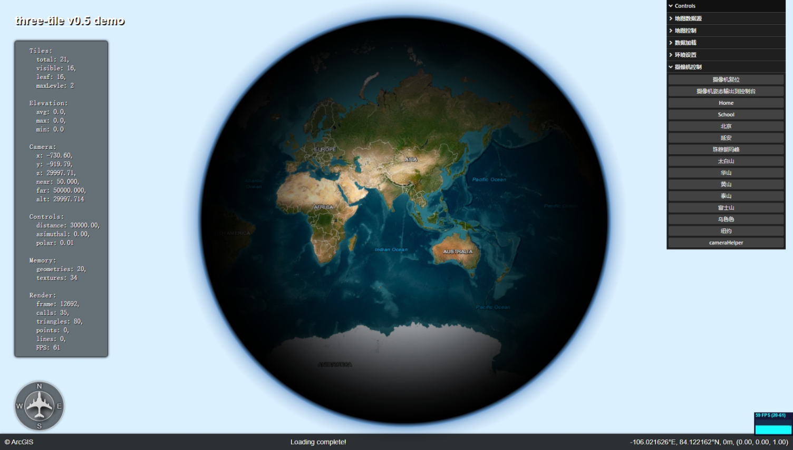
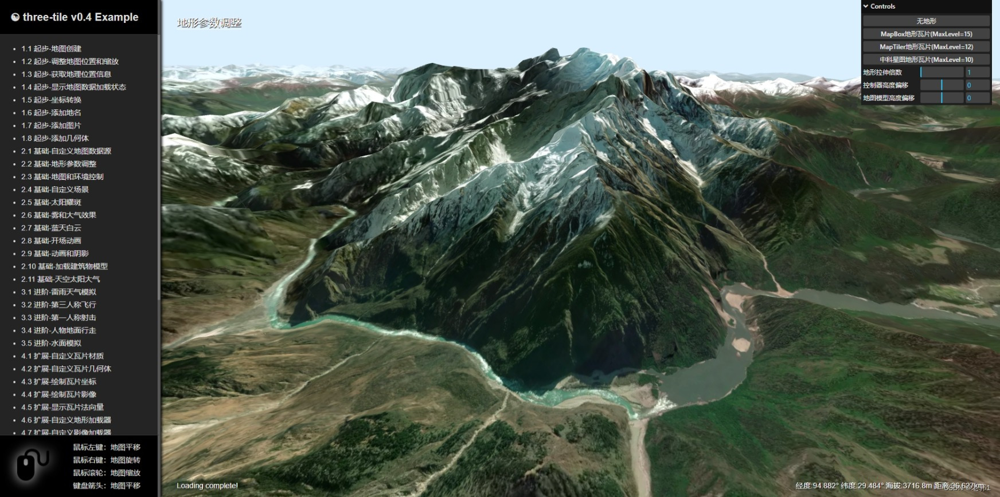

# **three-tile V0.6**

<p align='right'>hz_gjf@163.com</p>

## 1 简介

three-tile 是一个使用 [threejs](https://threejs.org/)开发的轻量级三维瓦片地图库，具有使用简单、资源占用少等优点，适用于给基于 threejs 开发应用增加三维地图。

注意：这不是Cesium，也不是Mapbox-gl，跟这些三维GIS框架没有一毛钱关系。

Source: https://github.com/sxguojf/three-tile

Examples: https://sxguojf.github.io/three-tile-example

Examples Source： https://github.com/sxguojf/three-tile-example







免责声明：

-   本框架不含任何地图数据，Example 中使用的地图均为直接调用第三方数据，使用中请遵循法律法规要求。

### 1.1 特点

-   轻量级：地图以一个三维模型方式提供，不会对已有程序架构产生任何影响。
-   依赖少：整个框架仅有 threejs（R165）一个依赖。
-   速度快：对资源占用做极致优化，核显也能轻松跑到 60FPS。
-   使用简单：熟悉 threejs 基本上没有学习成本。
-   扩展性强：数据、模型、纹理、材质、渲染过程均能根据自己需要扩展和替换。

### 1.2 开发环境

-   语言：TypeScript 100%
-   IDE： VSCode
-   打包：Vite 4.0
-   依赖：three 0.165

---

## 2 安装

### 2.1 直接引用

```
<script src="./three.js"></script>
<script src="./three-tile.umd.js"></script>
```

### 2.2 npm

```sh
npm i three-tile -S
```

```sh
yarn add three-tile -S
```

---

## 3 使用

和一般 threejs 应用一样，初始化 threejs 三维场景后，将地图模型加入场景即可完成地图的显示。

使用按以下步骤：

1. 初始化三维场景
2. 定义地图数据源
3. 创建地图模型
4. 地图模型加入三维场景

### 3.1 初始化三维场景

three-tile 的三维场景初始化和 threejs 相同，按 threejs 的套路初始化场景、摄像机、控制器、灯光等即可。为了便于使用，three-tile 还提供一个 GLViewer 类，它封装了场景初始化过程，可直接使用它进行初始化。

```typescript
import * as tt from "three-tile";

// 取得地图dom
const glContainer = document.querySelector<HTMLElement>("#map");
// 初始化三维场景(调用three-tile内置的初始化类)
const viewer = new tt.plugin.GLViewer(glContainer!);
```

如果你熟悉 threejs，场景初始化最好自己写，跟普通 threejs 程序并无太大差异。以下部分需要注意：

-   为了使地图坐标系与一般人类理解一致，three-tile 地图坐标方向采用东(x)北(y)上(z)方向，即地面在 x-y 平面上，海拔高度在 z 轴。而 threejs 一般平面在 xz 平面上，高度为 y 轴，所以初始化时需要使场景默认 up 指向 z 轴，可添加：Object3D.DEFAULT_UP.set(0, 0, 1) 即可。如果你的应用不能调整 up 值，可以将地图旋转-π/2° 完成。（一些朋友表示不适应，后期可能根据反馈调整）
-   地图添加光照才能显示。一般至少要有一个环境光，另外最好加一个直射光以通过地形法向量增强凹凸感。
-   场景控制器一般应用可使用 threejs 内置的 MapControls，其它控制器如 OrbitControls、FlyControls、PointerLockControls、TransformControls、FirstPersonControls 都能完美支持。

### 3.2 定义地图数据源

three-tile 内置了 Mapbox、ArcGis、Bing、天地图、高德、腾讯等多个厂商的瓦片地图源，可直接调用，也可根据根据需要自行扩展。地图切片默认使用 Google 方案，地形瓦片支持 MapBox 的 terrain-rgb 和 ArcGis 的 LERC 格式。如 MapBox 数据源创建如下：

```typescript
import * as tt from "three-tile";

// MapBoxToken 请更换为你自己申请的key
const MAPBOXKEY = "xxxxxxxxxx";

// mapbox 影像数据源
const mapBoxImgSource = new tt.plugin.MapBoxSource({
	token: MAPBOXKEY,
	dataType: "image",
	style: "mapbox.satellite",
});

// mapbox 地形数据源
export const mapBoxDemSource = new tt.plugin.MapBoxSource({
	token: MAPBOXKEY,
	dataType: "terrain-rgb",
	style: "mapbox.terrain-rgb",
	maxLevel: 15,
});
```

**注意：**

1. 多数数据源需要申请 token 才能使用，请不要用我示例中的。
2. 部分国外的地图无法访问，或是速度很慢，这个需要自己想办法，你们懂的。
3. 国内地图使用“火星坐标系”，影像图与地形有可能无法套准。
4. 地图数据使用，请遵循法律法规要求。

### 3.2 地图创建

使用 TileMap 类的工厂方法 create() 创建地图，加入场景。

```typescript
import * as tt from "three-tile";

// 创建地图
const map = tt.TileMap.create({
	// 影像数据源
	imgSource: mapBoxImgSource,
	// 地形数据源
	demSource: mapBoxDemSource,
	// 地图投影中央子午线经度
	lon0: 90,
	// 最小缩放级别
	minLevel: 2,
	// 最大缩放级别
	maxLevel: 18,
});

// 将地图加入三维场景
viewer.scene.add(map);
```

也可调用 TileMap 的构造函数创建地图。

## 4. 主要类说明

一般使用，仅需TileMap类即可完成绝大部分操作，TileMap继承于threejs的Mesh类，你可以把它当做一个普通的三维模型，加入scene即可使用。

### 4.1 构造函数

constructor(params: MapParams) ，MapParams：地图构造函数参数：

```typescript
 type MapParams = {
    imgSource: ISource[] | ISource; //影像数据源, image source
	demSource?: ISource; //高程数据源, terrain source	
	minLevel?: number; //最小缩放级别, maximum zoom level of the map
	maxLevel?: number; //最大缩放级别, minimum zoom level for the map
	lon0?: ProjectCenterLongitude; //投影中央经线经度, map centralMeridian longitude
    loader?: ITileLoader; //地图加载器, map data loader
	rootTile?: RootTile; //根瓦片, root Tile	
};
```

| 名称      | 类型                   | 说明                                                         |
| --------- | ---------------------- | ------------------------------------------------------------ |
| imgSource | ISource[] \| ISource   | 必选参数，默认为[]，用来指定地图瓦片的影像数据源，如果有多层影像数据可传入影像源数组，多层影像将以叠加混合方式显示。数据源的类型为ISource，three-tile已内置主流瓦片数据源，可直接创建使用。 |
| demSource | ISource                | 可选参数，默认为undefined，用来指定地图瓦片地形数据源，如果为空，地图将不显示数据，与影像数据源一样，可使用内置的地形数据源。 |
| minLevel  | number                 | 可选参数，地图瓦片的最小缩放级别，默认为0，当瓦片缩放级别小于它时地图瓦片将不在合并，注意它并不是用来限制地图大小的。 |
| axLevel   | number                 | 可选参数，地图瓦片的最最大放级别，默认为0，当瓦片缩放级别小于它时地图瓦片将不在细分，注意它并不是用来限制地图大小的。 |
| lon0      | ProjectCenterLongitude | 可选参数，地图投影中央经线经度，默认为0，它用来指定投影的中央经线的经度，注意它并不是用来指定地图中心位置的。 |
| loader    | ITileLoader            | 可选参数，地图数据加载器，默认为内置的TileLoader类实例，用来指定用哪个加载器加载数据生成瓦片模型和材质，高级开发者可通过自定义loader实现自定义数据加载、瓦片模型创建过程。 |
| rootTile  | RootTile               | 可选参数，地图根瓦片，默认为0级瓦片，用来指定从哪个开始创建瓦片树，绝大数情况可用默认值。 |

和二维webgis不同，创建地图时并不指定地图的中心经纬度和缩放系数。三维场景下缩放移动旋转模型一般是设置摄像机位置来调整的，即改变观察者位置。TileMap并不提供中心位置和缩放系数参数。

构造函数参数，均作为TileMap的同名属性进行封装，运行时可通过修改这些属性改变地图状态。

### 4.2 TileMap主要属性

| 名称             | 类型     | 说明                                                         |
| ---------------- | -------- | ------------------------------------------------------------ |
| autoUpdate       | boolean  | 默认为true，指定是否在每帧渲染中更新地图模型和数据。禁止更新主要有两种使用场景，一是在某些特效需要改变摄像机位置取得该摄像机位置下的离线渲染缓冲，如水面、反光等特效，由于autoUpdate为true时，地图瓦片会根据摄像机位置做增删，无法取得正确的缓冲图像，所以可在加载特效前禁止自动更新，完成后恢复自动更新；二是用于瓦片树和数据加载调试，运行时禁止自动更新可查看瓦片树是否正确得被细化、合并、剔除。 |
| autoLoad         | boolean  | 默认为true，指定是否在每帧渲染中加载地图模型和数据，与autoUpdate类似，但它仅控制数据是否加载，主要用于调试。 |
| autoAdjustMapZ   | boolean  | 默认为false，指定是否在每帧渲染中根据视野内瓦片的平均海拔高度，调整地图模型的Z坐标。地图Z坐标默认为海拔0米，在高海拔地区，地就显得很高，自动调整会将模型Z坐标调整为地面平均海拔高度，但在快速旋转或移动地图时，视野内瓦片平均海拔变化很大，地图有些漂移感觉，故一般设置为false。 |
| maxZInView       | number   | 取得视野内地形的最高高度                                     |
| minZInView       | number   | 取得视野内地形的最低高度                                     |
| avgZInView       | number   | 取得视野内地形的平均高度                                     |
| loadCacheSize    | number   | 默认为500，设置或取得瓦片数据的缓存大小，单位为块。较大的缓存能提高运行速度，但会耗费较多内存 |
| viewerBufferSize | number   | 默认为1.2，设置或取得瓦片渲染缓冲区大小系数，取值在1-5之间。为了减少资源占用，three-tile在瓦片离开视野立即释放，进入视野在重新加载，这就造成刚进入视野的瓦片出现短暂空白，通过调整viewerBufferSize，可控制瓦片离开视野多远会才被释放，用瓦片大小的倍数表示，增大它瓦片将离开视野较远时才释放，能够提高渲染速度，但会占用大量gpu资源。如果你的cpu够强悍可以设置大些。 |
| LODThreshold     | number   | 默认为1，设置会取得瓦片LOD阈值。TileMap本质上是一个动态LOD模型，它根据瓦片离摄像机的距离对模型进行细化或合并，越大瓦片细化越快，越小瓦片合并越快。 |
| attributions     | string[] | 取得瓦片数据归属者信息，如版权等。                           |
| tileCount        | Object   | 取得瓦片统计信息，如瓦片总数、叶子瓦片数、可视瓦片数等，主要用来进行调试。 |

### 4.3 TileMap主要方法：

| 名称                                                     | 参数                                  | 功能                                           |      |
| -------------------------------------------------------- | ------------------------------------- | ---------------------------------------------- | ---- |
| geo2pos(geo: Vector3)                                    | geo: 地理坐标（经纬度）               | 地理坐标转地图模型坐标                         |      |
| pos2geo(pos: Vector3)                                    | pos: 模型坐标                         | 地图模型坐标转地理坐标                         |      |
| getLocalInfoFromGeo(geo: Vector3)                        | geo: 地理坐标（经纬度）               | 获取指定地理坐标的地面信息（法向量、高度等）   |      |
| getLocalInfoFromWorld(pos: Vector3)                      | pos: 世界坐标                         | 获取指定世界坐标的地面信息（法向量、高度等）   |      |
| getLocalInfoFromScreen(camera: Camera, pointer: Vector2) | camera: 摄像机 <br />pointer:屏幕坐标 | 获取指定屏幕坐标的地面信息（法向量、高度等）   |      |
| reload()                                                 |                                       | 重新加载地图，在改变地图数据源后调用它才能生效 |      |
| static create(params: MapParams)                         | params:地图构建参数                   | 静态工厂函数，与构造函数功能参数相同           |      |

### 4.4 TileMap事件

| 事件名称           | 参数                                                    | 说明                         |      |
| ------------------ | ------------------------------------------------------- | ---------------------------- | ---- |
| update             | delta: 时间戳                                           | 在地图每帧更新时发生         |      |
| tile-created       | tile: 瓦片                                              | 在每块瓦片创建完成后发生     |      |
| tile-loaded        | tile: 瓦片                                              | 在每块瓦片数据加载完成时发生 |      |
| source-changed     | source: 地图数据源                                      | 在数据源对象发生变化时发生   |      |
| projection-changed | projection: 投影对象                                    | 在地图投影发生变化时发生     |      |
| loading-start      | itemsLoaded: 加载完成数量<br />itemsTotal: 加载完成合计 | 在地图数据开始加载时发生     |      |
| loading-error      | url: 瓦片url                                            | 在地图数据加载错误时发生     |      |
| loading-complete   |                                                         | 在地图数据加载完成时发生     |      |
|                    |                                                         |                              |      |


## 5. 约定和限制

-   坐标轴：地图模型为东北上坐标系，即 X 轴指向东，Y 轴指向北，Z 轴指向上。与 threejs 默认坐标不同需要注意。
-   坐标单位：角度单位为弧度，经纬度为度，3857 投影（默认）距离单位为公里，4326 投影距离单位为 0.01 度，高度单位均为公里。
-   瓦片数据：内建的地图影像和地形数据均使用图片格式（jpg、png、webp 等），支持 3854 和 4326 投影，暂不支持矢量瓦片。
-   瓦片属性：默认情况瓦片模型纹理透明属性开启，请注意渲染顺序。
-   地图清晰度：清晰度与本框架无关，取决数据源精度。
-   地图标注源：大部分国内厂商地图数据的地名、边界、道路有一定偏移，与地形无法完全匹配。
-   地图 token：大部分厂商的地图数据需要申请开发 key 才能使用，three-tile 示例包含一些厂商的 token，访问的人多了厂商会封掉它们，使用者一定要自己申请（又不要钱）避免直接使用。

更多使用方法见 example

## 6. 示例

提供一个完整浏览器引入方式示例供测试，可不用 web 服务直接在文件系统下运行：

```html
<!DOCTYPE html>
<html lang="zh-cn">
	<head>
		<meta charset="utf-8" />
		<meta
			name="viewport"
			content="width=device-width, user-scalable=no, minimum-scale=1.0, maximum-scale=1.0"
		/>
		<title>three-tile</title>
	</head>
	<style>
		html,
		body {
			background-color: #333;
			height: 100%;
			width: 100%;
			padding: 0;
			margin: 0;
			display: flex;
		}
		#map {
			flex: 1;
		}
	</style>
	<body>
		<div id="map"></div>
		<script src="./three.js"></script>
		<script src="./three-tile/three-tile.umd.cjs"></script>
		<script>
			console.log("three-tile start!");

			// MapBoxToken 请更换为你自己申请的key
			const MAPBOXKEY = "xxxxxxxxxx";

			// mapbox影像数据源
			const mapBoxImgSource = new tt.plugin.MapBoxSource({
				token: MAPBOXKEY,
				dataType: "image",
				style: "mapbox.satellite",
			});
			// mapbox地形数据源
			const mapBoxDemSource = new tt.plugin.MapBoxSource({
				token: MAPBOXKEY,
				dataType: "terrain-rgb",
				style: "mapbox.terrain-rgb",
				maxLevel: 15,
			});

			// 创建地图
			const map = tt.TileMap.create({
				// 影像数据源
				imgSource: mapBoxImgSource,
				// 地形数据源
				demSource: mapBoxDemSource,
				// 地图投影中央子午线经度
				lon0: 90,
				// 最小缩放级别
				minLevel: 2,
				// 最大缩放级别
				maxLevel: 18,
			});

			// 地图中心经纬度转为场景坐标
			const center = map.geo2pos(new THREE.Vector3(108.942, 34.2855));
			const container = document.querySelector("#map");
			const viewer = new tt.plugin.GLViewer(
				container,
				new THREE.Vector3(center.x, center.y, 0),
				new THREE.Vector3(center.x, center.y, 3e4),
			);

			viewer.scene.add(map);			

			// 动画漫游到3500km高空
			(() => {
				const timer = setInterval(() => {
					const pos = viewer.camera.position;
					pos.z -= 500;
					pos.y -= 10;
					if (pos.z < 100) {
						clearInterval(timer);
					}
				}, 10);
			})();
		</script>
	</body>
</html>
```
